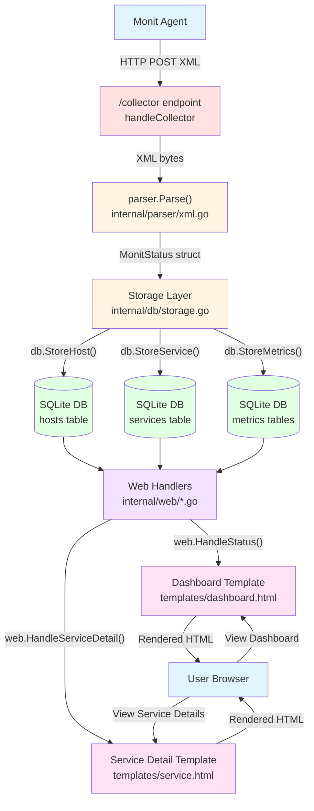

# cmonit Developer Documentation

This directory contains technical documentation for cmonit developers and contributors.

## Quick Reference

- **[Project Plan](project-plan.md)** - Architecture, phases, and implementation roadmap
- **[Monit Collector Protocol](monit-collector-protocol.md)** - Technical details of Monit XML protocol
- **[Monit XML Reference](monit-xml-reference.md)** - Complete XML field reference
- **[Testing Plan](testing-plan.md)** - Acceptance tests for all phases
- **[Coding Standards](coding-standards.md)** - Code documentation guidelines
- **[API Documentation](api.md)** - M/Monit-compatible HTTP API reference

## For End Users

If you're looking to **use** cmonit (not develop it), see the main [README.md](../README.md) in the project root.

---

## Project Status: ✅ Production Ready

All planned phases have been successfully completed:

| Phase | Status | Description |
|-------|--------|-------------|
| Phase 1 | ✅ Complete | Collector daemon receiving Monit data |
| Phase 2 | ✅ Complete | Multi-page web dashboard |
| Phase 3 | ✅ Complete | Time-series graphs with Chart.js |
| Phase 4 | ✅ Complete | M/Monit-compatible HTTP API |

---

## Architecture Overview

### Technology Stack

**Backend:**
- **Go 1.21+** - Single binary, excellent concurrency
- **SQLite** - Embedded database with WAL mode
- **Standard library** - `net/http`, `html/template`, `encoding/xml`

**Frontend:**
- **Tailwind CSS** - Utility-first CSS framework (CDN)
- **Chart.js** - Time-series visualization (CDN)
- **Server-side rendering** - Go templates, no build step

### Data Flow Diagram

The following diagram shows how data flows from Monit agents through cmonit to the web interface, with actual function names from the codebase:



**Key Data Flow Steps:**

1. **Collection** - Monit agent sends XML status via HTTP POST to `:8080/collector`
2. **Authentication** - `handleCollector()` validates HTTP Basic Auth (monit:monit)
3. **Parsing** - `parser.Parse()` converts XML to Go structs using `encoding/xml`
4. **Storage** - Database functions store parsed data:
   - `StoreHost()` - Host information and platform details
   - `StoreService()` - Service status and monitoring state
   - `StoreMetrics()` - Time-series metrics (CPU, memory, disk, network, etc.)
5. **Query** - Web handlers query database when users visit dashboard
6. **Rendering** - Go templates generate HTML with Tailwind CSS styling
7. **Display** - Browser renders the responsive web interface

**Separation of Concerns:**
- **Collector** (port 8080) - Receives data from Monit agents
- **Web UI** (port 3000) - Serves dashboard to users
- **Database** - Central storage with automatic schema migrations
- **Templates** - Server-side rendering with no JavaScript build step

### Project Structure

```
cmonit/
├── cmd/cmonit/main.go           # Application entry point
├── internal/
│   ├── db/
│   │   ├── schema.go            # Database schema & migrations
│   │   └── storage.go           # Data storage operations
│   ├── parser/
│   │   ├── xml.go               # Monit XML parser
│   │   └── xml_test.go          # Parser unit tests
│   └── web/
│       ├── handler.go           # Dashboard HTTP handlers
│       ├── handlers_status.go   # Service detail handlers
│       ├── api.go               # Metrics & action APIs
│       └── mmonit_api.go        # M/Monit compatibility API
├── templates/
│   ├── dashboard.html           # Main dashboard template
│   └── service.html             # Service detail template
├── rc.d/cmonit                  # FreeBSD startup script
└── docs/                        # Developer documentation
```

---

## Key Features Implemented

### Core Functionality
- ✅ HTTP collector endpoint receiving Monit XML status
- ✅ SQLite storage with automatic schema migrations (current: v8)
- ✅ Multi-page dashboard: Status, Host Details, Service Details, Events
- ✅ Real-time system metrics graphs (Load, CPU, Memory)
- ✅ Service control actions (start, stop, restart, monitor, unmonitor)
- ✅ Event tracking with Monit restart detection
- ✅ Intelligent host health indicators (green/yellow/red based on poll interval)
- ✅ Host lifecycle management with safe deletion (>1 hour offline)
- ✅ Remote host monitoring with ICMP/TCP/UDP response times
- ✅ Comprehensive system metrics display (load, CPU breakdown, memory, swap)
- ✅ Service detail pages for all service types (0-8)

### M/Monit API Compatibility
- ✅ `GET /status/hosts` - List all hosts with status
- ✅ `GET /status/hosts/:id` - Get specific host details
- ✅ `GET /status/hosts/:id/services` - List host services
- ✅ `GET /events/list` - Query events with pagination
- ✅ `GET /events/get/:id` - Get specific event details
- ✅ `GET /admin/hosts` - Administrative host management
- ✅ `DELETE /admin/hosts/:id` - Delete stale host and all related data

### Security & Production
- ✅ HTTP Basic Authentication for web UI
- ✅ TLS/HTTPS support with certificate configuration
- ✅ Configurable listen addresses (IPv4/IPv6)
- ✅ Syslog integration for daemon logging
- ✅ PID file management
- ✅ FreeBSD rc.d integration

---

## Development Workflow

### Building

```bash
# Standard build
go build -o cmonit ./cmd/cmonit

# With version info
go build -ldflags "-X main.version=1.0.0" -o cmonit ./cmd/cmonit
```

### Testing

```bash
# Run all tests
go test ./...

# Run with coverage
go test -cover ./...

# Specific package
go test ./internal/parser/
```

### Local Development

```bash
# Development mode (current directory)
./cmonit -db ./cmonit.db -pidfile ./cmonit.pid -listen localhost:3000

# Clean start
rm -f cmonit.db cmonit.db-* cmonit.pid
go build -o cmonit ./cmd/cmonit && ./cmonit
```

---

## Database Schema

The database uses schema versioning with automatic migrations (current version: **8**):

### Core Tables

**hosts** - Monitored host information
- Platform details (OS, CPU count, memory)
- Monit daemon information (version, uptime, poll_interval)
- HTTP API credentials for actions
- Last seen timestamp for health status calculation
- Health indicators based on poll_interval multiples

**services** - Services monitored on each host
- Service type, status, and monitoring state
- Resource usage (CPU%, memory%, PID for processes)
- Associated with host via `host_id` foreign key

**metrics** - Time-series system metrics
- System CPU, memory, swap, load average
- Per-process CPU and memory usage
- Indexed by `(host_id, collected_at)` for fast queries

**filesystem_metrics** - Time-series filesystem metrics (Schema v2)
- Block/inode usage and percentages
- Filesystem type, flags, permissions
- Read/write operations and bytes

**network_metrics** - Time-series network interface metrics (Schema v3)
- Link state, speed, duplex mode
- Upload/download packets, bytes, errors
- Per-interface statistics

**file_metrics** - File monitoring metrics (Schema v4)
- File mode, ownership (uid/gid), size
- Timestamps (access, change, modify)
- Checksum type and value
- Hard link count

**program_metrics** - Program execution metrics (Schema v4)
- Program start time and exit status
- Program output (captured via CDATA)
- Execution results tracking

**remote_host_metrics** - Remote host monitoring metrics (Schema v8)
- ICMP ping response times and type
- TCP/UDP port monitoring (hostname, port, protocol, response time)
- Unix socket monitoring (path, protocol, response time)
- Supports both Remote Host services (type 4) and Process services (type 3)

**events** - Service state change events
- Automatic logging on status changes
- Monit restart detection
- Event types defined in `monit-xml-reference.md`

**schema_version** - Schema migration tracking
- Current version number
- Applied timestamp

---

## API Endpoints

### Dashboard Web UI

- `GET /` - Status overview (all hosts with health indicators)
- `GET /host/{id}` - Host details with graphs
- `GET /host/{id}/service/{name}` - Service detail page with type-specific metrics
- `GET /host/{id}/events` - Host event history
- `GET /api/metrics?host={id}&range={1h|6h|24h}` - Metrics for graphs
- `POST /api/action` - Execute service actions

### Collector

- `POST /collector` - Receive Monit XML status (Basic Auth: monit:monit)

### M/Monit Compatibility API

All endpoints return JSON:

- `GET /status/hosts` - List hosts with summary
- `GET /status/hosts/{id}` - Host details
- `GET /status/hosts/{id}/services` - Service list
- `GET /events/list?limit=N&offset=N` - Paginated events
- `GET /events/get/{id}` - Single event
- `GET /admin/hosts` - Administrative host list
- `DELETE /admin/hosts/{id}` - Delete stale host (requires >1 hour offline)

See `internal/web/mmonit_api.go` for implementation details.

---

## Configuration Options

All configuration via command-line flags:

```
-collector    Collector port number (default "8080") - inherits IP from -listen
-listen       Web UI listen address (default "localhost:3000")
-db           Database path (default "/var/run/cmonit/cmonit.db")
-pidfile      PID file path (default "/var/run/cmonit/cmonit.pid")
-syslog       Syslog facility (daemon, local0-7, empty for stderr)
-web-user     HTTP Basic Auth username (empty = disabled)
-web-password HTTP Basic Auth password
-web-cert     TLS certificate file (empty = HTTP only)
-web-key      TLS key file
```

---

## Performance Characteristics

Based on testing with 2 hosts, 13 services:

- **Collector latency:** ~10ms to receive and store Monit XML
- **Dashboard load:** <200ms for status overview
- **Host detail page:** <300ms with graphs
- **Graph rendering:** <500ms for 24h of metrics
- **Memory usage:** ~20MB RSS
- **Database size:** ~1-2MB per day per host

---

## FreeBSD Deployment

```bash
# Install binary and rc.d script
sudo cp cmonit /usr/local/bin/
sudo cp rc.d/cmonit /usr/local/etc/rc.d/
sudo chmod +x /usr/local/etc/rc.d/cmonit

# Configure in rc.conf
sudo sysrc cmonit_enable="YES"
sudo sysrc cmonit_listen="0.0.0.0:3000"
sudo sysrc cmonit_syslog="daemon"

# Start service
sudo service cmonit start
```

See `rc.d/cmonit` for all configuration options.

---

## Service Types Supported

cmonit fully supports all Monit service types with dedicated detail pages:

- **Type 0 (Filesystem)**: Block/inode usage, I/O operations, filesystem type
- **Type 1 (Directory)**: Path, timestamps, permissions
- **Type 2 (File)**: Mode, ownership, size, checksums, timestamps
- **Type 3 (Process)**: CPU%, memory, PID, threads, file descriptors, port/unix socket monitoring
- **Type 4 (Remote Host)**: ICMP ping, TCP/UDP port checks, response times
- **Type 5 (System)**: Load average, CPU breakdown, memory/swap usage
- **Type 6 (Fifo)**: Path, timestamps, permissions
- **Type 7 (Program)**: Exit status, execution output
- **Type 8 (Network)**: Link state, speed, duplex, upload/download statistics

---

## Known Limitations

1. **M/Monit API**: Partial implementation - basic status/events/admin queries only
2. **Multi-user auth**: Only single username/password for web UI
3. **HTTPS collector**: Collector endpoint is HTTP only (agents use HTTP Basic Auth)
4. **Push-only**: No active polling of Monit agents (by design)

---

## Contributing

When contributing code:

1. Follow the [Coding Standards](coding-standards.md) for documentation
2. Add tests for new features
3. Update relevant docs when adding features
4. Test with actual Monit agents, not just mock data

---

## License

BSD 2-Clause License - See [LICENSE](../LICENSE) file

---

## Additional Resources

- [Monit Official Documentation](https://mmonit.com/monit/documentation/)
- [M/Monit HTTP API](https://mmonit.com/documentation/http-api/)
- [Monit XML Format](monit-xml-reference.md)
- [Testing Strategy](testing-plan.md)
